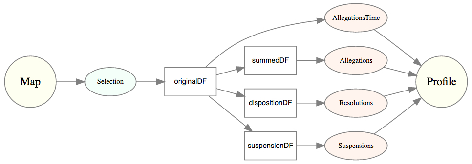

<h2>Overview</h2>
    
The intent of this project is to represent ProPublica's data in a visually appealing and interactive format. The project was developed in Rstudio using the shiny apps development platform and published to my shinyapps.io account (link provided above). The project displays the TSA field offices (i.e., TSA offices located at a major US airport) on a map to illustrate the number of allegations by field office and to generate a profile (or mini-report) when the user selects an office on the map. The final cleaned data set contains 4100 cases across 24 field offices between 2002 and 2012.

This shiny app allows users to sort information so that they can easily find answers to the following questions: 1) How many allegations were there at each field office and what were they? 2) What were the top allegations? 3) How were allegations resolved? 4) How many suspensions were given and what was the range of days assigned? and 5) How did the number of allegations change over time? 

<h3>Methods</h3> 
    
<h4>Data</h4>
    
Data was obtained from ProPublica's <a href="https://projects.propublica.org/data-store/">Data Store</a>. Cleaning was required due to the conversion from pdf to csv that the ProPublica's data team implemented in order to post the data online. For example, words like "Removal" were often coded as "Remov,l" and case numbers with the number "5" were often transcribed as "S" (reading SS2S instead of 5525). Other cases included, recoding symbols (e.g., \%, \&, \@) that often appeared after the conversion process for reasons unknown. The _unique_, _sapply_, and _mode_ commands in R were used to detect errors for all variables. Whereas the _grep_ and the _recode_ (from the _car_ package) functions were used to isolate the rows that contained errors and recode them. 

The cleaned dataset contains 5213 entries with 5208 unique records. 5 ids were coincidently assigned to different cases from different filed offices (FOs). The case numbers were: 905 (FOs: NYC and NWK), 1122 (FOs: CLT and CHI), 1744 (FOs: CHI and HQ), 3055 (FOs: LAS and NYC), and 3077 (FOs: CIN and LAS). Four of the twenty-eight FOs could not be linked using <a href="https://www.world-airport-codes.com/">www.world-airport-codes.com</a> with an airport as their FO code was unique to the TSA and were excluded from the shiny app. These FOs were: FC, HQ, NYC, and WFO. Therefore, the final cleaned dataset with unknown FOs excluded contains 4100 cases across 24 FOs between the years 2002 - 2012. 

<h4>Development Platform</h4>
    
The following R packages were used to develop all visualizations:
    
* <a href="https://rstudio.github.io/leaflet/">leaflet</a>: "Leaflet is the leading open-source JavaScript library for mobile-friendly interactive maps."
* <a href="http://ggplot2.org/">ggplot2</a>: "...a plotting system for R ...which tries to take the good parts of base and lattice graphics and none of the bad parts."
* <a href="https://cran.r-project.org/web/packages/RColorBrewer/index.html">RColorBrewer</a>: Color palette extension for R graphics.
* <a href="https://plot.ly/">plotly</a>: Graphics package for creating interactive charts. 
* <a href="http://rcharts.io/">RCharts</a>: Graphics package for interactive charts in R using javascript libraries.

All graphs are enabled for interactivity and data exploration using the packages listed above. Custom tooltips (hover info) were enabled for all plots to give users a quick summary of each data point and relevant information. Click events were enabled on the map to allow users to select a data point to view quick information and to generate the FO profile. The structure and flow of data is described in the next section. 

<h4>Structure & Design</h4>
    
The aim was to create a layout that is clean and visually appeally, which users can interactive and explore the data. The key elements of the shiny app are the _interactive map_ (created using the leaflet package) and the _FO profile_ (a rmarkdown file). The structure of the shiny app is illustrated in the following diagram.

    
The app works off of one primary element: the map selection.

When as user makes a selection on the map, the selection parameter that is "stored" in that selection is the _field office code_ (e.g., if Dever Airport FO is selection, "DEN" is the selection parameter). Using the _grep_ function, the master database is subsetted to all row entries that match the FO (e.g., take all rows that match "DEN"). This is the _originalDF()_ dataset that contains all data across all years for the selected FO. This dataset is then used to the generate three summarized datatsets via the _dplyr_ package (using the: originalDF() %>% group_by() %>% summarise() command). The first summarized dataset summarized dataset, _summarizedDF()_, contains data summarized by allegation for all years combined by field office which is used to generate the _How Many Violations are Recorded?_ section in the FO profile. Resolutions for all years combined are summarized into the _dispositionsDF()_ dataset, these outputs are sent to the _How Were Violations Resolved?_ section. The _suspensionsDF()_ gets summarized data of suspensions for all years combined for displaying the distrubution of suspensions by the number of days suspended in the _Distribution of Suspensions as a Final Disposition_ section. The _originalDF()_ is used in the final section, _Allegations over Time_, to allow users to graph the any allegation recorded at that FO across all years. 

<h2>Notes</h2>
    
* To report any issues or offer any suggestions, contact <a href="mailto:davidruvolo51@gmail.com?Subject=TSA%20Shiny%20app%20inquiry">me</a>. This app's ui/server files can be found on <a href="https://github.com/davidruvolo51">github</a>.

* It is possible this dataset contains missing or NA values. If so, these are still included in the dataset and listed as "MISSING". Some of the selections may result in having a "MISSING" included in the graphics.

* The donut chart illustrates of those who were suspended, how many days of suspension did they receive? In the center, the top line represents the number of days an individual could be suspended for, whereas the value directly below represents the number of individuals who received that suspension. The length of the segments indicate more cases. 

* In the final chart, some allegations may have only one record between 2002 - 2012 or records between other years (e.g., 2003 - 2007).

<h2>Supplemental Information </h2>
<h4>TSA FOIA Request 2012-TSFO-00764</h4>

 

The data provided in response to the FOIA request reflects <i>allegations</i> of misconduct involving
Federal Air Marshals (FAMs) over an approximate ten (10) year period of time from November
2002 to early February 2012. All allegations of misconduct must be reported and investigated
pursuant to Agency policy. Therefore, the data includes minor misconduct of an administrative
nature, as well as more serious misconduct. In reviewing the entries, it is important to note that
the recording of allegations into broad categories of misconduct such as “Absent Without Leave”
or “Loss of Equipment” does not necessarily reflect the seriousness of the offense. After a
comprehensive analysis of the entries, it was determined that:

<ul>
<li>42 percent of these cases were closed with a letter of counseling, verbal counseling, or
letter of guidance and direction, none of which are disciplinary actions.</li>
<li>13 percent of these cases were closed with no findings of misconduct.</li>
<li>7 percent of these cases involved employees who separated from Federal service.</li>
<li>37 percent of these cases resulted in disciplinary actions.</li>
</ul>

To be clear, the vast majority of FAMs are dedicated law enforcement professionals who
conduct themselves in an exemplary manner. TSA and FAMS have taken numerous proactive
measures to create a workplace model built on professionalism, integrity, and accountability with
no tolerance for misconduct. All TSA employees, including FAMs, are subject to the Standards
of Ethical Conduct for Employees of the Executive Branch (5 C.F.R. Part 2635) as well as the
TSA Management Directive No. 1100.73-5, <i>Employee Responsibilities and Code of Conduct</i>.
Additionally, FAMs are subject to policy OLE 1112, <i>Employee Responsibilities and Conduct</i>.
TSA take all allegations of misconduct seriously. In instances when allegations of misconduct
arise, TSA policy requires the prompt and thorough investigation and adjudication of the
allegations. As Law Enforcement Officers, misconduct by FAMs is adjudicated by the Office of
Professional Responsibility (OPR) which issues adverse, disciplinary, and corrective actions
against TSA employees, up to and including removal, for egregious violations that undermine
security interests, pose a threat to TSA employees, the traveling public, or result in significant
monetary loss. As an independent entity, OPR determines the appropriate level of discipline, if
warranted, and holds employees accountable for misconduct. Additionally, all TSA employees,
including FAMs, are subject to recurrent annual vetting, including criminal checks and periodic
security clearance reviews.

TSA and FAMS continually strive to maintain a culture of accountability within its workforce.
Notably, in 2015, as a direct result of internal initiatives, FAMS has seen a significant reduction
in misconduct cases resulting in disciplinary actions compared to the time period covered in your
request.

Like many agencies, proactive efforts cannot prevent all employee misconduct. There are a
handful of employees who betray the trust bestowed upon them. This small group of employees
should not adversely reflect on the vast majority of FAMs who are dedicated and committed to
performing the FAMS mission to protect the traveling public.

