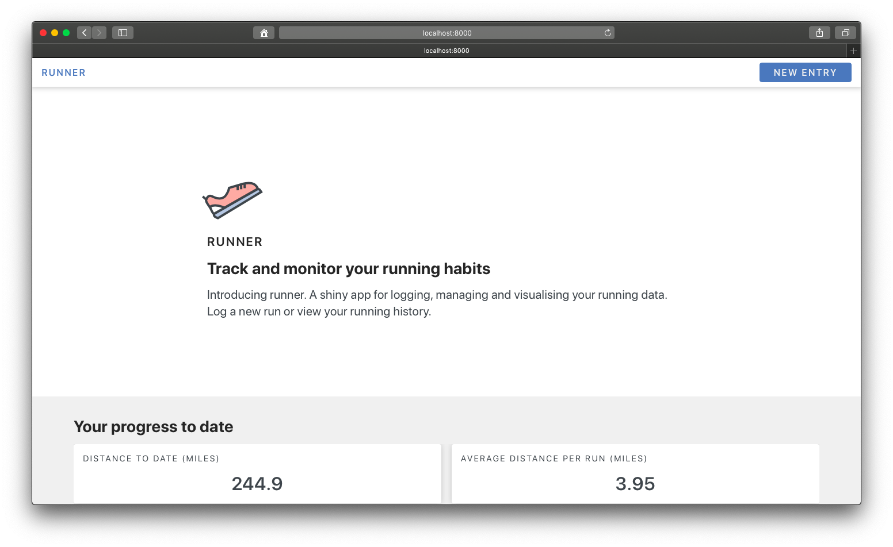

# runneR
## A shiny application for analyzing your running data

One day, I decided to give myself a 1-hour shiny app challenge where I had to build a shiny app for tracking and monitoring a given daily activity. This shiny app, runneR, is the product of that challenge. RunneR is a simple shiny app for monitoring running activity. I started using this shiny application a lot more over the years as I can collect and generate the charts that I would like rather than paying for subscriptions on other sites. 

In the live application, I've connected the application to private googlesheets where the data is stored. I use a running app to record data or provide a estimate.

This is a demo application and I included some sample data. At the moment, only the visualizations are working. The data entry feature is still in progress. 

More to follow!
