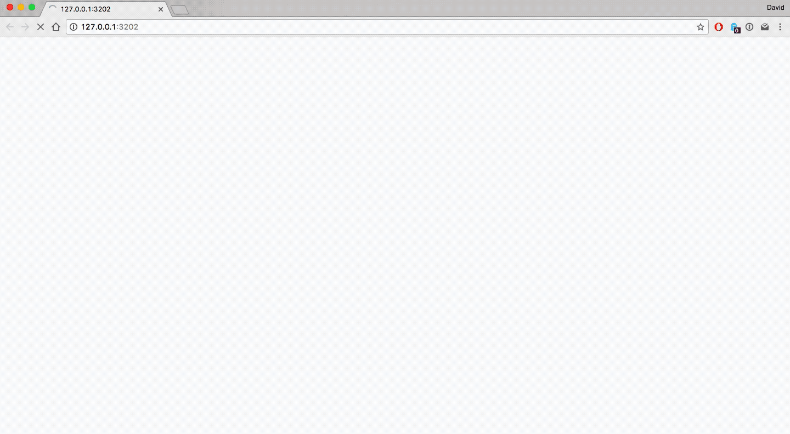

## runneR: Monitoring running activity in R
#### A 1-hour shiny app challange



One day, I decided to give myself a 1-hour shiny app challenge where I had to build a shiny app for tracking and monitoring a given daily activity. This shiny app, runneR, is the product of that challenge. RunneR is a simple shiny app for monitoring running activity. 

You can read more about the challenge and my experience here.

### Requirements

Previous versions of this app used local storage methods for saving data; however, this is now axed as of Oct 11, 2017. Instead, this uses the googlesheets R package for data storage ([github/jennybc/googlesheets](https://github.com/jennybc/googlesheets)). 

If you do not want to use googlesheets or would like more information, other methods are outlined [here](https://shiny.rstudio.com/articles/persistent-data-storage.html).

Before you get started, there are few things you need to setup.

1. Install the `googlesheets` package

```
install.packages("googlesheets")
```

2. Generate a token


3. Establish `saveData()` and `loadData()` functions (as mentioned in the article [Persistent Data Storage in Shiny app](https://shiny.rstudio.com/articles/persistent-data-storage.html)) in order to retrieve data from your googlesheet.

```
table <- "you/table/name/here"
```

`saveData()`

```
saveData <- function(data) {
    # Grab the Google Sheet
    sheet <- gs_title(table)
    # Add the data as a new row
    gs_add_row(sheet, input = data)
}
```

`loadData()`
```
loadData <- function() {
    # Grab the Google Sheet
    sheet <- gs_title(table)
    # Read the data
    responses <<- gs_read_csv(sheet)
}
```

4. Test with a mock data

```
test <- data.frame(
    date = "2050-12-31",
    status = "yes",
    distance = 99
)

saveData(test)

```

